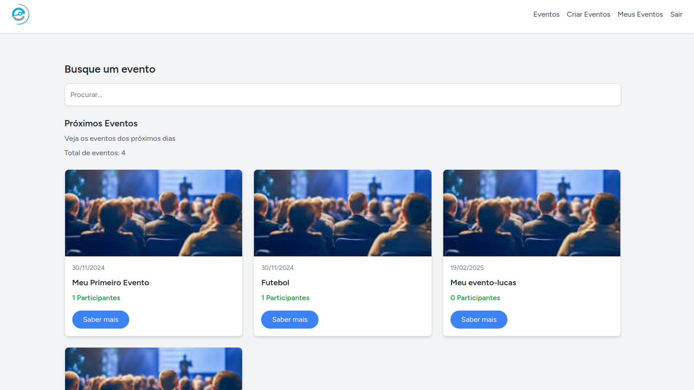
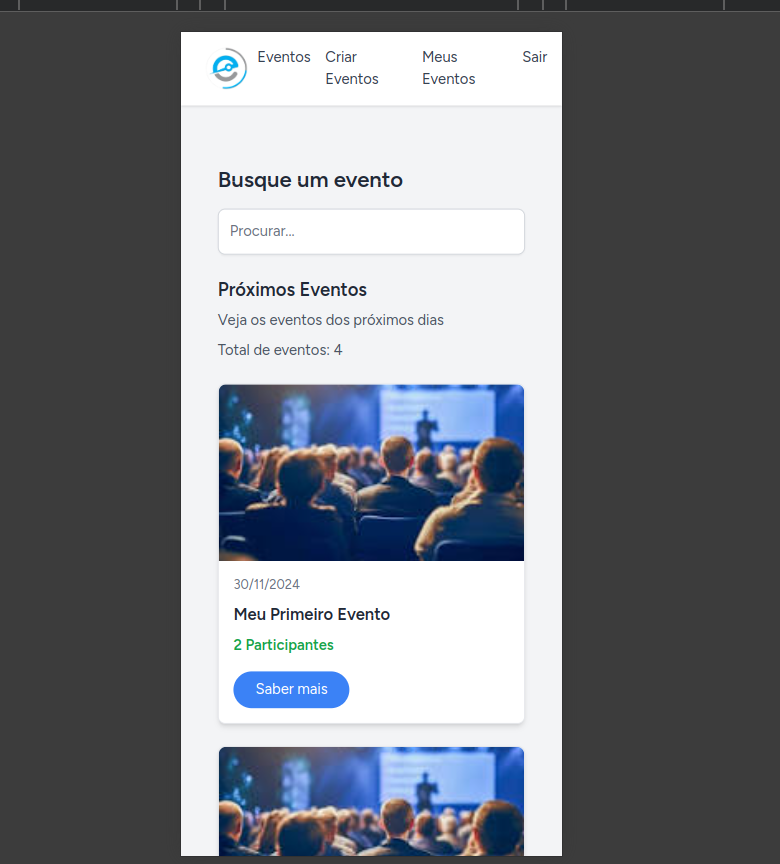
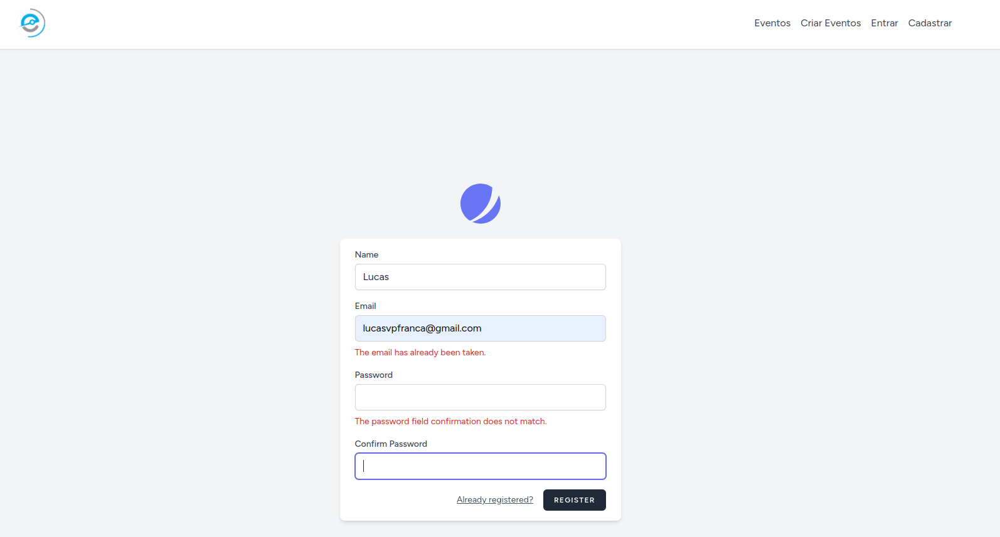
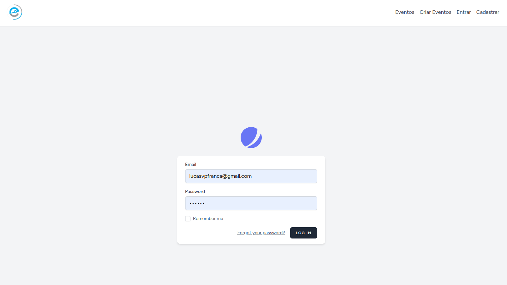
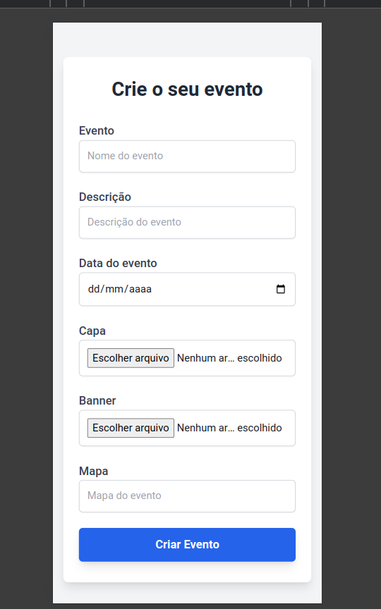
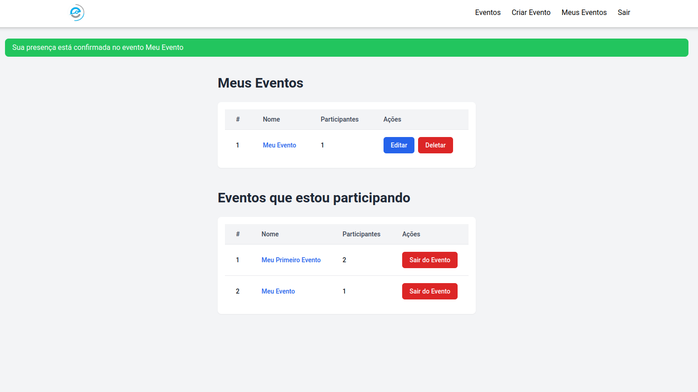
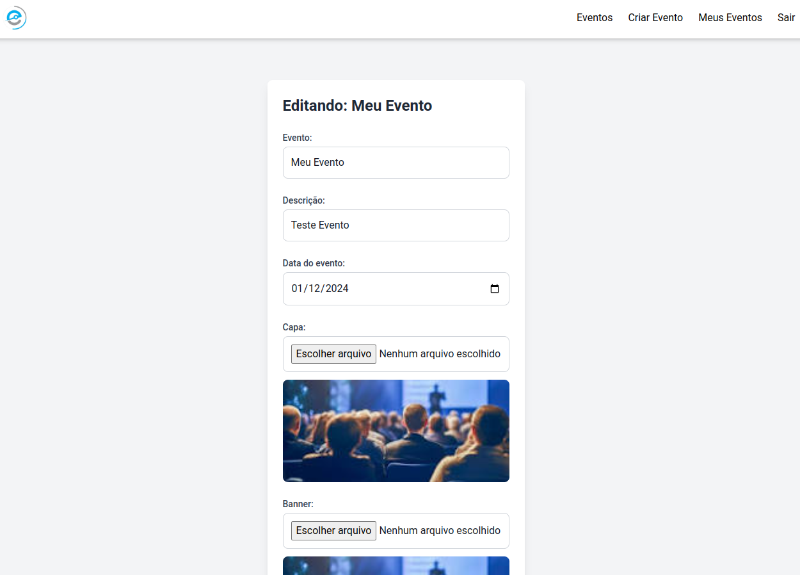
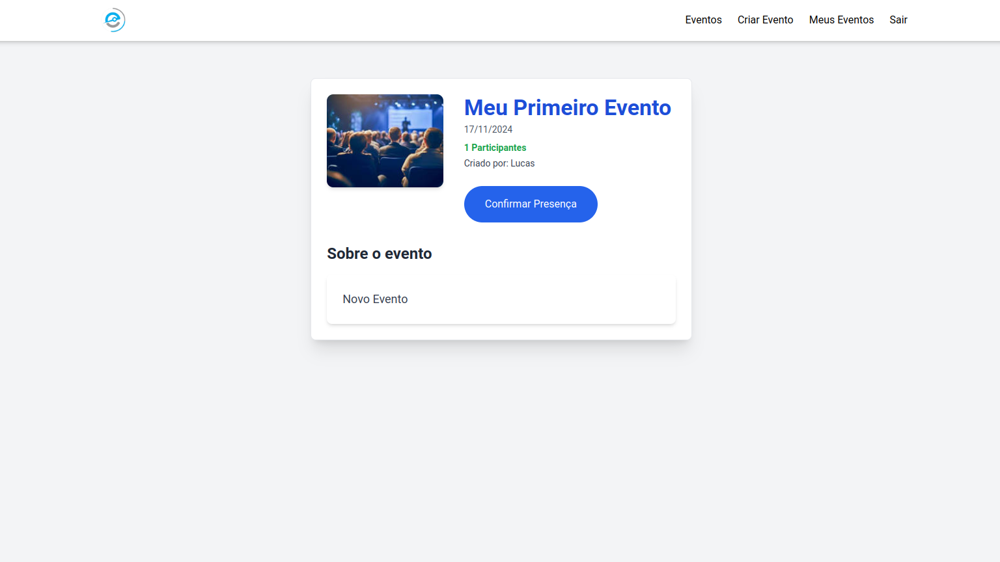

# 🎉 Sistema de Gerenciamento de Eventos (EM DESENVOLVIMENTO)

## Descrição
Este sistema de gerenciamento de eventos permite que os usuários criem, visualizem, editem, e participem de eventos. Ele foi desenvolvido com **Laravel** no backend, **Vue.js** no frontend, e **Tailwind CSS** para um design responsivo e moderno. O projeto também utiliza **Jetstream** e **Inertia.js** para facilitar a interação entre o frontend e o backend.

## Capturas de tela

### Página Inicial

### Tela Inicial no Mobile

### Tela de Cadastro

### Tela de Login

### Tela de Criar Evento no Mobile

### Tela de Confirmação

### Tela de Edição

### Detalhes do Evento

### Funcionalidades:
- ✅ **Autenticação de Usuários**: Usuários podem se registrar, fazer login e gerenciar sua conta.
- ✅ **Criação de Eventos**: Usuários podem criar eventos com nome, descrição, data, capa, banner, mapa.
- ✅ **Exibição de Eventos**: Visualize todos os eventos criados e participe daqueles que desejar.
- ✅ **Participação e Cancelamento**: Usuários podem confirmar presença ou sair de eventos em que estão inscritos.
- ✅ **Edição e Deletação de Eventos**: Criadores de eventos podem editar ou excluir seus próprios eventos.
- ✅ **O organizador** (usuário que criou o evento) deverá ver uma lista com todos os inscritos.
- ✅ **O usuário** autenticado pode visualizar a lista de eventos com nome e data.
- ✅ **O usuário** Ao clicar em um evento, o usuário pode ver os detalhes completos do evento.
- ✅ **O usuário**  O usuário poderá acessar a página específica do evento com todas as informações cadastradas.
- ✅ **O Sistema**  exibe mensagens de erro se o usuário tentar se registrar ou fazer login com dados inválidos (ex.: senha muito curta, email já em uso).
- ✅ **O Sistema** O sistema exibe mensagens de sucesso ou erro ao criar, editar ou excluir eventos e ao inscrever-se/cancelar inscrição.
·      

·       

·        

·       
## Tecnologias Utilizadas

- **Laravel 11**: Framework PHP para o backend.
- **Vue.js 3**: Framework JavaScript para o frontend.
- **Tailwind CSS**: Biblioteca CSS para um design moderno e responsivo.
- **Jetstream**: Pacote de autenticação e gerenciamento de sessão.
- **BLADE**: Template Engine do Laravel.

## Considerações Finais / Impedimentos

Este projeto foi desenvolvido com o objetivo de aprender e aplicar **Inertia.js** com **Vue 3**, Foi construido inicialmente em **Laravel Blade**  e posteriormente refatorado para inertia devido ao pouco tempo disponível para estudos dessa nova tecnologia na minha stack. 

Devido ao tempo limitado (2 dias aproximadamente), não foi possível concluir todas as funcionalidades que eu gostaria. Durante o desenvolvimento, priorizei a construção do sistema com as tecnologias que já conhecia e posterior refatoração de algumas páginas para o Inertia e Vue 3, mas nem todas as páginas foram convertidas. Até o momento, apenas as páginas **Index** e **Show** foram refatoradas para usar Inertia e Vue 3, enquanto as demais páginas ainda estão utilizando Blade.

As páginas não refatoradas serão uma prioridade para futuras atualizações, pois o objetivo é migrar completamente para o Inertia e Vue 3, dada a adoção dessa tecnologia pela empresa. No entanto, como o tempo de estudo foi curto e o foco estava em aprender o **Inertia.js**, optei por realizar a refatoração progressivamente para não comprometer a **entrega** do projeto.

Futuramente, continuarei a refatorar as páginas restantes e a melhorar a interação com o frontend para aproveitar ao máximo as funcionalidades do Inertia e Vue 3.

Agradeço pela compreensão e por acompanhar o desenvolvimento deste projeto!

